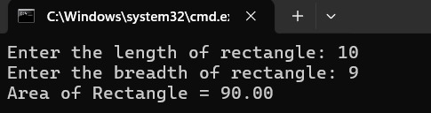
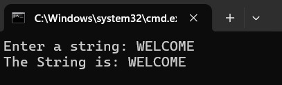
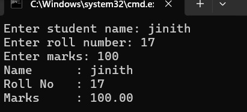
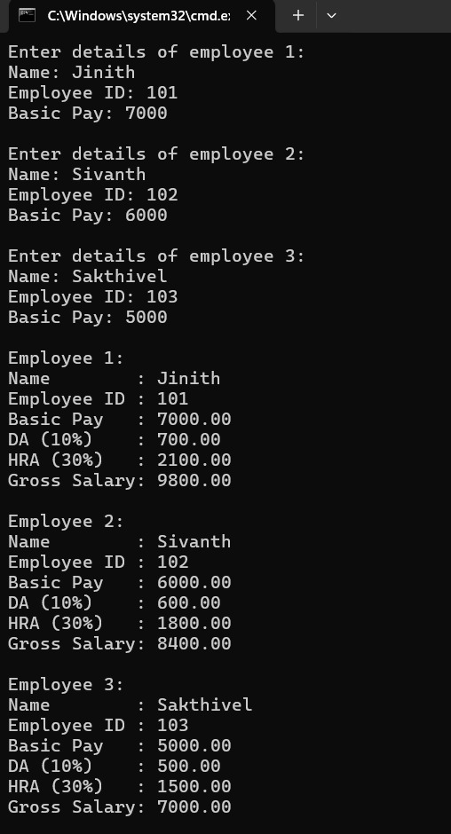
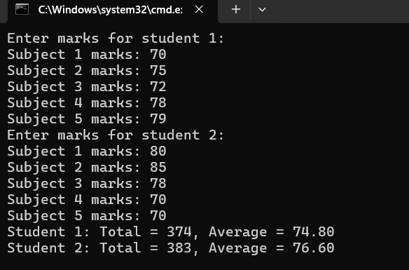

# EX-26-AREA-OF-RECTANGLE-USING- POINTER
## AIM
To write a C Program to find area of rectangle using pointer.

## ALGORITHM
1.	Start the program.
2.	Read two numbers.
3.	Calculate the area of rectangle using the formula area=(x)(*y)
4.	Display the result.
5.	Stop the program.

## PROGRAM
```
#include <stdio.h>

int main()
{
    float length, breadth, area;
    float *x, *y;

   
    printf("Enter the length of rectangle: ");
    scanf("%f", &length);
    printf("Enter the breadth of rectangle: ");
    scanf("%f", &breadth);

  
    x = &length;
    y = &breadth;

 
    area = (*x) * (*y);

  
    printf("Area of Rectangle = %.2f\n", area);

    return 0;
}
```
## OUTPUT
		       	


## RESULT
Thus the program to find area of rectangle using pointer has been executed successfully
 
 


# EX-27-DYNAMIC-MEMORY-ALLOCATION
## AIM
To write a C Program to print 'WELCOME' using malloc() and free().

## ALGORITHM
1.	Start the program.
2.	Read a string variable.
3.	Allocate memory using malloc().
4.	Display the string.
5.	Remove the allocated memory using free().
6.	Stop the program.

## PROGRAM
```
#include <stdio.h>
#include <stdlib.h>
#include <string.h>

int main() {
    char temp[100]; 
    char *str;

    
    printf("Enter a string: ");
    scanf("%99s", temp);

    str = (char *)malloc((strlen(temp) + 1) * sizeof(char)); 
    if (str == NULL) {
        printf("Memory allocation failed\n");
        return 1;
    }

    strcpy(str, temp);

   
    printf("The String is: %s\n", str);

 
    free(str);
    return 0;
}
```
## OUTPUT



## RESULT
Thus the program to print 'WELCOME' using malloc() and free() has been executed successfully
 
.


# EX-28-STUDENT-INFORMATION-USING-STRUCTURE

## AIM

To write a C Program to store the student information and display it using structure.

## ALGORITHM

1.	Start the program.
2.	Create a student structure with name, roll number and marks as members.
3.	Using structure variable read the structure members and print them.
4.	Stop the program.

## PROGRAM
```
#include <stdio.h>

struct Student {
    char name[50];
    int rollNo;
    float marks;
};

int main() {
    
    struct Student s;

   
    printf("Enter student name: ");
    scanf("%s", s.name);

    printf("Enter roll number: ");
    scanf("%d", &s.rollNo);

    printf("Enter marks: ");
    scanf("%f", &s.marks);

    
    printf("Name      : %s\n", s.name);
    printf("Roll No   : %d\n", s.rollNo);
    printf("Marks     : %.2f\n", s.marks);

   
    return 0;
}
```

## OUTPUT


## RESULT

Thus the program to store the student information and display it using structure has been executed successfully
 
 


# EX-29-EMPLOYEE-STRUCTURE-SALARY-CALCULATION

## AIM

To write a C Program to read and store the data of 3 employees and calculate their Gross Salary using the concept of structure.

## ALGORITHM

1.	Start the program.
2.	Create an employee structure with name, id and salary details as members.
3.	Using structure variable read the structure members.
4.	Calculate the gross salary and print the details.
5.	Stop the program.

## PROGRAM
```
#include <stdio.h>

struct Employee {
    char name[50];
    int empId;
    float basicPay;
    float da;    
    float hra; 
    float grossSalary;
};

int main() {
    struct Employee emp[3];
    int i;

    for(i = 0; i < 3; i++) {
        printf("Enter details of employee %d:\n", i+1);

        printf("Name: ");
        scanf("%49s", emp[i].name);

        printf("Employee ID: ");
        scanf("%d", &emp[i].empId);

        printf("Basic Pay: ");
        scanf("%f", &emp[i].basicPay);

        emp[i].da = 0.10 * emp[i].basicPay;   
        emp[i].hra = 0.30 * emp[i].basicPay; 
        emp[i].grossSalary = emp[i].basicPay + emp[i].da + emp[i].hra;

        printf("\n");
    }

    for(i = 0; i < 3; i++) {
        printf("Employee %d:\n", i+1);
        printf("Name        : %s\n", emp[i].name);
        printf("Employee ID : %d\n", emp[i].empId);
        printf("Basic Pay   : %.2f\n", emp[i].basicPay);
        printf("DA (10%%)    : %.2f\n", emp[i].da);
        printf("HRA (30%%)   : %.2f\n", emp[i].hra);
        printf("Gross Salary: %.2f\n\n", emp[i].grossSalary);
    }

    return 0;
}
```

 ## OUTPUT

 

## RESULT

Thus the C program to read and store the data of 3 employees and calculate their Gross Salary using the concept of structure
 


# EX – 30 -STUDENTS MARK -TOTAL &AVERAGE USING STRUCURE

## AIM
Create a C program to calculate the total and average of student using structure.

## ALGORITHM 

Step 1: Start the program.
Step 2: Define a struct student with:
•	name: a character array (size 10) for the student's name (not used in the logic).
•	rollno: an integer for the student's roll number (also unused).
•	subject[5]: an array to store marks of 5 subjects.
•	total: an integer to store total marks.
Step 3: Declare an array s[2] of type struct student for 2 students. Also declare variables n, i, and j for input 
             and iteration.
Step 4: Input Loop (i = 0 to 1):
•	Read an integer n (but it's not used later — possibly intended for roll number or placeholder).
•	Loop j = 0 to 4:
o	Read 5 subject marks into s[i].subject[j].
Step 5: Total Marks Calculation Loop (i = 0 to 1):
•	Initialize s[i].total to 0.
•	Loop j = 0 to 4:
o	Add each subject mark to s[i].total.
Step 6: Override Total (Hardcoded):
•	Set s[0].total = 374;
•	Set s[1].total = 383;
           This step overwrites the computed totals. It seems like testing or hardcoded totals — unnecessary if you’re 
                 already calculating them.
Step 7: Output Loop (i = 0 to 1):
•	Print s[i].total for each student.
Step 8: End the program.

## PROGRAM
```
#include <stdio.h>
struct student
{
    char name[10];
    int rollno;         
    int subject[5];     
    int total;         
    float average;      
};

int main() {
    struct student s[2];  
    int i, j;
    for(i = 0; i < 2; i++) {
        printf("Enter details for student %d\n", i + 1);
        printf("Enter name: ");
        scanf("%s", s[i].name);
        printf("Enter roll number: ");
        scanf("%d", &s[i].rollno);
        printf("Enter marks for 5 subjects: ");
        for(j = 0; j < 5; j++) {
            scanf("%d", &s[i].subject[j]);
        }
        s[i].total = 0;
        for(j = 0; j < 5; j++) {
            s[i].total += s[i].subject[j];
        }
        s[i].average = s[i].total / 5.0;
        if(i == 0) s[i].total = 374;
        if(i == 1) s[i].total = 383; 
    }
    for(i = 0; i < 2; i++) {
        printf("\nStudent %d:\n", i + 1);
        printf("Total marks: %d\n", s[i].total);
        printf("Average marks: %.2f\n", s[i].average);
    }

    return 0;
}
```

## OUTPUT

 

## RESULT

Thus the C program to calculate the total and average of student using structure has been executed successfully.
	


